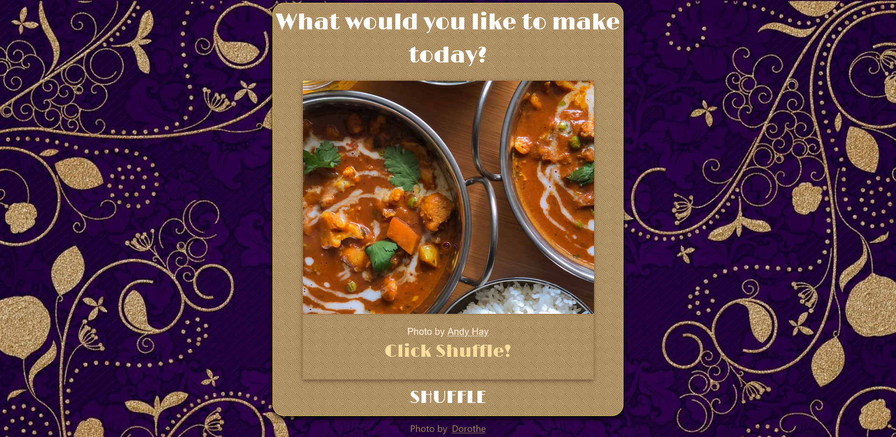
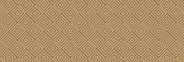

## Table of Contents

- [About The Project](#About-The-Project)
- [Technologies Used](#Technologies-Used)
- [Screenshots](#screenshots)
- [Local Setup](#local-setup)
- [Credits](#credits)
- [Status](#status)

## About The Project

This is a simple dinner randomizer I made to help my mum decide what to make for dinner.

Insipired by my mum asking me what to make for dinner so often I decided to put some of our meals into a website she can tap on to get a idea of what to for dinner.

Aiming for a an art deco theme and coloring. Somewhat inspired by my local Pakistani restaurant.

You can find the web version here:

## Technologies Used

Javasscript
CSS
React
Material UI

Google Font LimeLight.
Responsive Design.
Built with create-react-app boilerplate.

## Screenshots

Closer look at the gold CSS pattern:

## Local Setup

To run this project locally. Download or clone the project from GitHub.

Install the dependecies with the npm install command.

`npm install`

Once dependcies are successfully installed. Run locally with npm run start.

`npm run start`

## Credits

Icon Credit:
<a href="https://www.flaticon.com/free-icons/restaurant" title="restaurant icons">Restaurant icons created by Freepik - Flaticon</a>

Image Credits: From Free Image sites Unsplash, Pixabay and Pexels

1. Purple Background by [Dorothe](https://pixabay.com/users/darkmoon_art-1664300/?utm_source=link-attribution&utm_medium=referral&utm_campaign=image&utm_content=3561709)
2. Generic Picture by [Andy Hay](https://unsplash.com/@eastcoastkitchen?utm_source=unsplash&utm_medium=referral&utm_content=creditCopyText)
3. White Rice by [Loren Castillo](https://www.pexels.com/photo/cooked-food-on-gray-ceramic-plate-9218754/)
4. Keema (Minced Meat) by [Pure Punjabi](https://www.pexels.com/photo/ground-meat-with-green-peas-in-a-bowl-7340942/),
5. Scrambled Eggs by [Albany Capture](https://unsplash.com/@albanycapture?utm_source=unsplash&utm_medium=referral&utm_content=creditCopyText),
6. Black Eyed Beans by [Bundo Kim](https://unsplash.com/@bundo?utm_source=unsplash&utm_medium=referral&utm_content=creditCopyText),
7. Brown Rice by [Mumtahina Tanni](https://www.pexels.com/photo/fried-rice-on-white-and-red-plate-6260921/),
8. Kidney Beans [Saundarya Srinivasan](https://unsplash.com/@saundiii?utm_source=unsplash&utm_medium=referral&utm_content=creditCopyText),
9. Fish and Chips by [Suzy Hazelwood](https://www.pexels.com/photo/fries-2966196/),
10. Spagetti [Klaus Nielsen](https://www.pexels.com/photo/tasty-pasta-bolognese-and-fork-served-on-table-6287527/),
11. Pasta [Aleksandra Tanasiienko](https://unsplash.com/@tasikola_pl?utm_source=unsplash&utm_medium=referral&utm_content=creditCopyText),
12. Yellow Lentils [Robert Borges](https://www.pexels.com/photo/curry-rice-dish-in-a-plate-10464100/),
13. Gobi (Cauliflower) [Frank Holleman](https://unsplash.com/@fraenkly?utm_source=unsplash&utm_medium=referral&utm_content=creditCopyText),
14. Curry [Monika Grabkowska](https://unsplash.com/@moniqa?utm_source=unsplash&utm_medium=referral&utm_content=creditCopyText),
15. Chicken [Jezebel Rose](https://unsplash.com/@jezebelrose?utm_source=unsplash&utm_medium=referral&utm_content=creditCopyText),
16. Chickpeas [Dragne Marius](https://unsplash.com/@marius_dragne?utm_source=unsplash&utm_medium=referral&utm_content=creditCopyText),
17. Ladyfingers [FOX](https://www.pexels.com/photo/cooked-food-on-white-oval-platter-6063320/),

CSS for the golden pattern used in the background of the card is generated from this css website: https://10015.io/tools/css-background-pattern-generator. Using the nested squares pattern.

## Status

This project is completed and I am not working on it at the moment.

In the future I would like to include the recipe and ingredient list for each dinner item.
